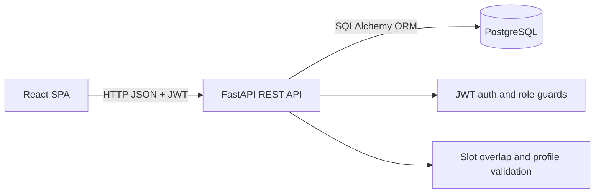
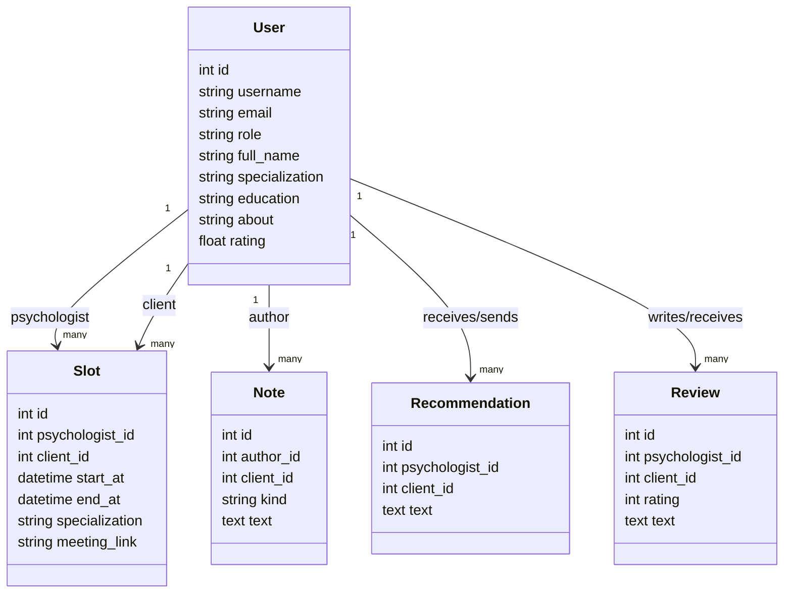
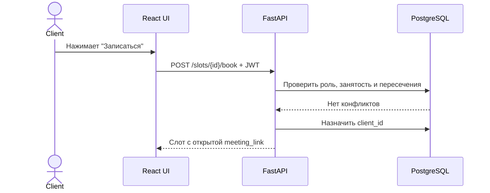

# Сервис онлайн-консультаций с психологом

Fullstack CRUD-приложение для записи клиентов на консультации, ведения профилей, заметок, рекомендаций и отзывов.

## Анализ предметной области

В системе есть три роли: клиент, психолог и администратор. Клиент сохраняет анонимность, ищет специалистов, записывается на свободные временные слоты, видит ссылку на видеоконсультацию только после записи, читает рекомендации и оставляет отзыв. Психолог ведёт профиль с ФИО, специализацией, образованием и рейтингом, публикует непересекающиеся слоты, пишет рабочие заметки по клиентам и отправляет рекомендации. Администратор управляет пользователями.

Ключевые ограничения предметной области:
- роли имеют разные права доступа;
- слоты психолога не должны пересекаться;
- клиент не может иметь две записи на одно время;
- ссылка на консультацию скрыта от клиента до записи;
- рейтинг психолога пересчитывается по отзывам клиентов;
- поиск работает по никам всех пользователей и по настоящему имени психолога.

## Клиент-серверная архитектура

Выбрана классическая клиент-серверная архитектура: React-клиент обращается к REST API FastAPI, сервер выполняет бизнес-валидацию и работает с PostgreSQL через SQLAlchemy. Авторизация реализована через JWT Bearer Token.







## Стек

- Frontend: React 18, Vite, CSS.
- Backend: Python 3.11, FastAPI, SQLAlchemy, Pydantic.
- Auth: JWT, bcrypt-хеширование паролей.
- Database: PostgreSQL 16.
- Контейнеризация: Docker и Docker Compose.
- Тестирование: pytest, fuzz-тесты валидации ролей и временных окон.

## Структура проекта

```text
backend/
  app/
    routes/          REST-маршруты auth/users/slots/notes
    database.py      подключение к PostgreSQL
    models.py        SQLAlchemy-модели
    schemas.py       Pydantic-схемы
    security.py      JWT и пароли
    seed.py          тестовые данные
    validators.py    бизнес-валидация
  tests/             fuzz-тесты
frontend/
  src/
    components/      экраны и UI-компоненты
    api.js           клиент REST API
    App.jsx          маршрутизация вкладок
docker-compose.yml
```

## Запуск

```bash
docker compose up --build
```

Frontend: http://localhost:5173  
Backend OpenAPI: http://localhost:8000/docs

Frontend в Docker запускается как собранное приложение через `vite preview`, поэтому белый экран из-за dev-сервера Vite не должен появляться. Если браузер всё равно показывает пустую страницу, проверьте логи:

```bash
docker compose logs frontend
docker compose logs backend
```

Если ранее запускалась старая версия БД со старой схемой, очистите контейнеры и поднимите проект заново:

```bash
docker compose down -v
docker compose up --build
```

## Тестовые аккаунты

- Администратор: `admin` / `admin123`
- Психолог: `psy_maria` / `psych123`
- Клиент: `client_lena` / `client123`

## Проверки и fuzz-тестирование

```bash
docker compose run --rm backend python -m pytest tests
```

Fuzz-тесты случайными данными проверяют:
- отклонение неизвестных ролей;
- запрет клиенту заполнять поля профиля психолога;
- корректность временных окон и пересечений слотов.

## Облачное развёртывание

Приложение готово к развёртыванию на любом Docker-совместимом хостинге: Render, Railway, Timeweb Cloud, Yandex Cloud или VPS с Docker. Для прода нужно заменить `JWT_SECRET`, задать внешний PostgreSQL или persistent volume, прописать домен frontend в `CORS_ORIGINS`, затем выполнить:

```bash
docker compose up --build -d
```
